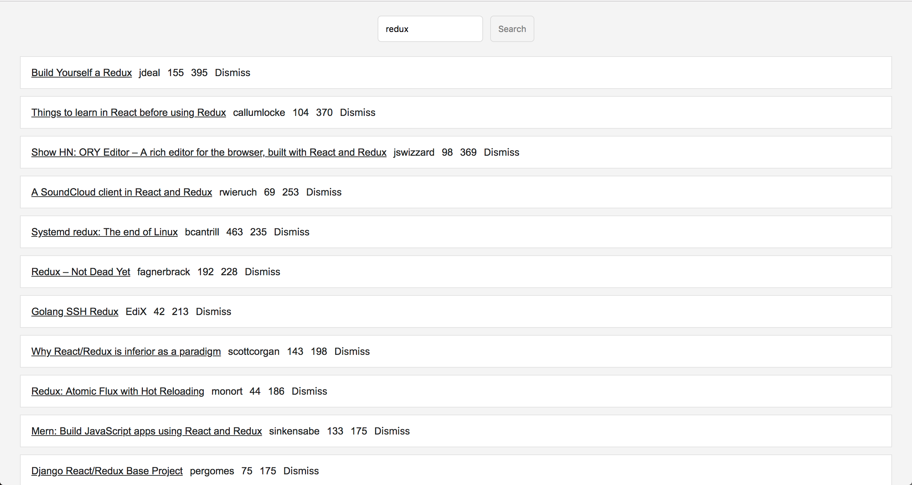
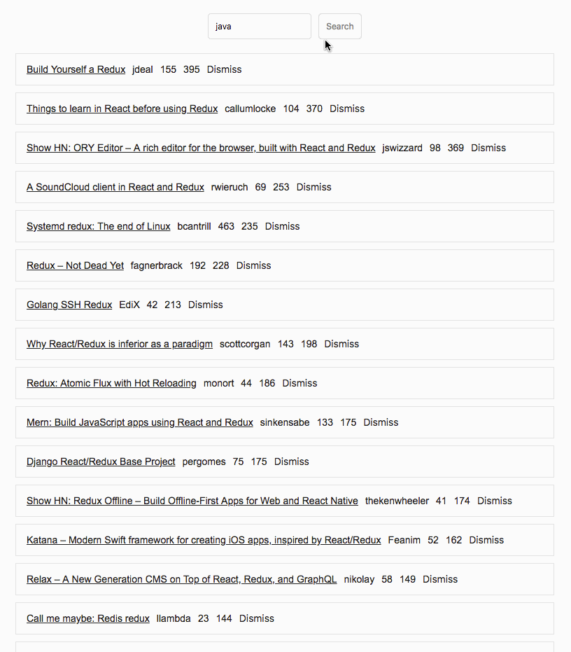

# react-hackernews

## 说在前面
学习`react`，大概有半个月的时间了，发现这个框架对JS的基础要求很高，要想达到自由的境界，`es6`和JS基础一定要扎实！

数据抓取的[`hackernews`](https://news.ycombinator.com/)上的数据，功能很简单：

* 列表数据展示
* 搜索过滤
* 删除数据
* 分页抓取

通过这个项目，了解到了`React`的一点皮毛，并且发现了`ES6`的优雅的地方。

扎实的基础加上`React`这个优秀的框架，再配上`VSCode`优美的IDE，让我恍惚觉得开发前端是件令人愉悦的事情。





## 技术栈:

* `React` 16.3
* `ES6`

用到的`es6`知识点如下：

* 箭头函数
* 类
* 对象初始化
* 解构
* 扩展操作符
* 模版字符串
* 动态属性名
	
	```
	result: {
	  ...result,
	  [searchKey]: { hits: updateHits, page }
	}
	```

## 运行项目

```
git clone https://github.com/zengfxios/react-hackernews.git
cd hackernews
npm start
```

## 最后
**念念不忘，必有回响!**


